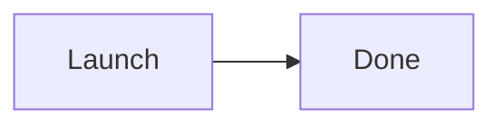

iconify

```mermaid
flowchart LR
  A[<span class="iconify" data-icon="mingcute:rocket-line"></span> Launch]
  A --> B[<span class="iconify" data-icon="tabler:circle-check"></span> Done]

```

<HTMLBlock>{`

`}</HTMLBlock>