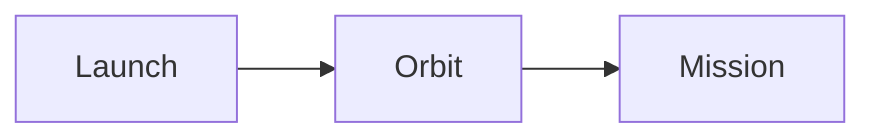
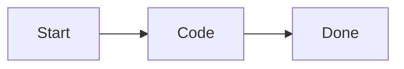
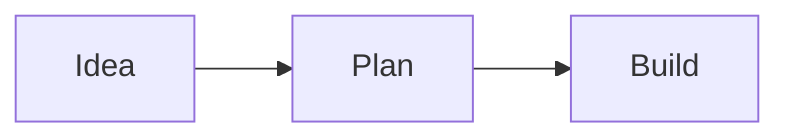
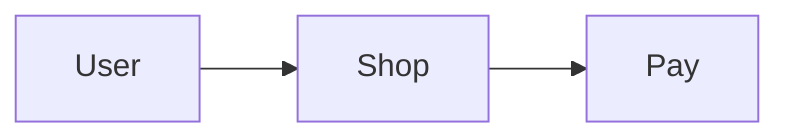
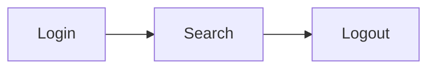

```mermaid
flowchart LR
  A[<span class="iconify" data-icon="mingcute:rocket-line"></span> Launch] 
    --> B[<span class="iconify" data-icon="mingcute:planet-line"></span> Orbit] 
    --> C[<span class="iconify" data-icon="mingcute:flag-line"></span> Mission]

```

 

```mermaid
flowchart LR
  A[<span class="iconify" data-icon="tabler:player-play"></span> Start] 
    --> B[<span class="iconify" data-icon="tabler:code"></span> Code] 
    --> C[<span class="iconify" data-icon="tabler:circle-check"></span> Done]

```

 

```mermaid
flowchart LR
  A[<span class="iconify" data-icon="heroicons-outline:light-bulb"></span> Idea] 
    --> B[<span class="iconify" data-icon="heroicons-outline:clipboard-document-check"></span> Plan] 
    --> C[<span class="iconify" data-icon="heroicons-outline:wrench-screwdriver"></span> Build]

```

 

```mermaid
flowchart LR
  A[<span class="iconify" data-icon="bi:person-circle"></span> User] 
    --> B[<span class="iconify" data-icon="bi:cart"></span> Shop] 
    --> C[<span class="iconify" data-icon="bi:credit-card"></span> Pay]

```

 

```mermaid
flowchart LR
  A[<span class="iconify" data-icon="mdi:login"></span> Login] 
    --> B[<span class="iconify" data-icon="mdi:magnify"></span> Search] 
    --> C[<span class="iconify" data-icon="mdi:logout"></span> Logout]

```