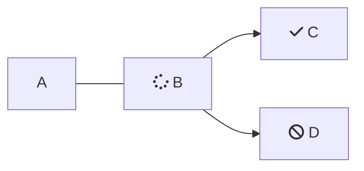
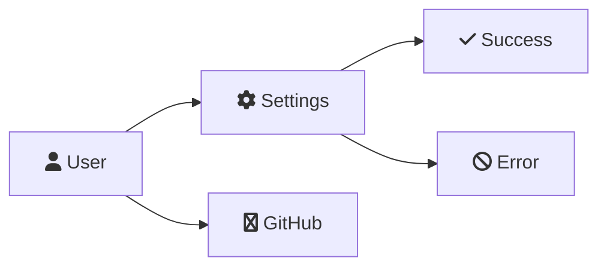
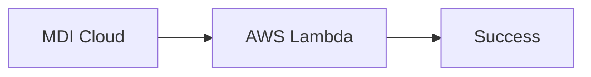

```mermaid
flowchart LR 
 A --- B[fa:fa-spinner B] 
 B --> C[fa:fa-check C] 
 B --> D[fa:fa-ban D]
```

 

```mermaid
flowchart LR
    A[fa:fa-user  User] --> B[fa:fa-cog  Settings]
    B --> C[fa:fa-check  Success]
    B --> D[fa:fa-ban  Error]
    A --> E[fa:fa-github  GitHub]

```

 

```mermaid
flowchart LR
  A[<span class="iconify" data-icon="mdi:cloud"></span>  MDI Cloud] --> B[<span class="iconify" data-icon="logos:aws-lambda"></span>  AWS Lambda]
  B --> C[<span class="iconify" data-icon="mdi:check-circle"></span>  Success]

```